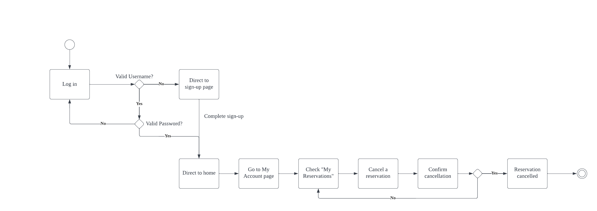

# Specification Phase Exercise

A little exercise to get started with the specification phase of the software development lifecycle. See the [instructions](instructions.md) for more detail.

## Team members
- [Andrei Stoica](https://github.com/andreicstoica)
- [Laura Mazoni Lourenco](https://github.com/qlaueen)
- [Larry Li](https://github.com/86larryli)
- [Leo Xu](https://github.com/leo6016)

## Stakeholder Interview
**Interview #1 Details**
- Hansen Lian, a 20 year old frequent thrifter (buys most of their clothes second hand)
- Has experience thrifting in their home town, as well as Washington D.C. where they attend university
  
**Problems/Frustrations**
- Frustrating having to dig through racks, and return often to find something you both like and fits - takes so much time!
- Annoying not being able to check inventory online (expectation is now to be able to do this).
- Frustrated that there isn’t a system alerted of certain items. 
- Would ideally want to be able to get quotes for their own clothes online. (consignment) 
  
**Goals/Needs**
- To be able to view store inventory online (size + price as well).
- Be able to sign up for alerts for certain brands, items, sizes. 
- Automated quote tool for the consignment aspect of thrift stores.
- Have an account to view store balance/manage alerts. 

**Interview #2 Details**
- Harry, a mid 20s year old employee at Hamlet's vintage.
  
**Problems/Frustrations**
- Customers are often overhwhelmed by the amount of clothes in the store and don't want to look through everything.
- Takes a long time for customers to find a few pieces that fit them and match their style.
- Customers that want to sell their clothes to Hamlet's are sometimes disappointed by how much they are willing to credit. 
- Customers see how crowded the store is and leave before looking.
  
**Goals/Needs**
- Give customers less options to reduce burden of choice.
- Help customers find their sizes and styles faster.
- Have a more transparent pricing system for those selling their clothes to Hamlet's 
- Clear up the physical space in the store to allow for more customers. 

## Product Vision Statement
An app that creates a digital catalog for thrift stores, where users can also manage their settings and get quotes for their own clothes. 

## User Requirements
1. As a customer, I want to sign up so I can start making reservations and selling stuff.
1. As a customer, I want to log in so I can start making reservations and selling stuff.
1. As a customer, I want to manage my account so I can change my personal information.
1. As a customer, I want to view the store inventory so I don't have to go in person.
1. As a customer, I want to receive alerts for something I'm interested in so I won't miss the item.
1. As a customer, I want to reserve the product I like so I don't waste my time going to the store to find out it is sold out.
1. As a customer, I want to manage my reservation so I can cancel a reservation I am no longer interested in.
1. As a customer, I want to give information on the product I want to sell to the store owner so I can get a quote before going to the store.
1. As a store owner, I want to manage store inventory so I can add/update/remove products when needed.
1. As a store owner, I want to see the customer's reservation so I can take the product off the shelf.
1. As a store owner, I want to see the customer's submitted selling form so I can contact them regarding the item.

## Activity Diagrams

## Wireframe diagrams

[Wireframe diagram here.](https://www.figma.com/file/PaCajW4fRFDzCO8RtN7roS/Project1?node-id=0%3A1)
